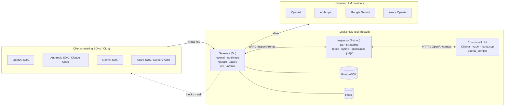

<div align="center">

# LeakShield

[](LICENSE)
[](#status--roadmap)
[](gateway/go.mod)
[](inspector/pyproject.toml)
[](panel/package.json)
[](.github/workflows/ci.yml)
[](.github/workflows/codeql.yml)
[](https://securityscorecards.dev/)
[](https://github.com/Hesper-Labs/leakshield/stargazers)

</div>

LeakShield is an open-source **AI Gateway + DLP** that sits between your employees and the LLM
providers they use (OpenAI, Anthropic, Google, Azure). It isolates provider keys, inspects every
prompt with a **local LLM of your choice** for sensitive data leaks, and gives you full
per-employee audit and usage analytics.

> **Self-host only.** LeakShield is designed to run inside your network. There is no managed
> SaaS offering and no telemetry phone-home.

## Why LeakShield

When employees use ChatGPT, Claude, or any LLM through your company's API key, they routinely
paste content that should never leave the building — customer records, identity numbers, contract
text, internal financials. That data ends up in provider logs and may end up in training pipelines.
Most existing tools fix only one half of this problem:

- DLP libraries (Llama Guard, NeMo, Presidio) classify content but don't manage keys, billing, or
  routing.
- AI gateways (LiteLLM, Portkey) manage keys and routing but ship no real DLP.
- Cloud DLP services (Lakera, Protect AI) work, but they're SaaS — your prompts leave your
  network.

LeakShield does both, locally. Your prompts never leave your infrastructure unless they pass DLP.

## Inside the Panel

A real five-minute walkthrough of the UI you get out of the box. Every screenshot below is a live
render of the Next.js admin panel against the running gateway — no mockups.

### 1. Setup wizard — first install

Visiting the panel on a fresh install routes the visitor straight into a single create-admin
screen. No "sign-in vs sign-up" confusion.

<p align="center">
  
</p>

The wizard then walks through provider connection (with live test-connection feedback) and the
first virtual key issuance, with the plaintext key shown exactly once.

<table>
  <tr>
    <td></td>
    <td></td>
  </tr>
  <tr>
    <td align="center"><sub>Step 2 — pick a provider, paste an API key, watch the live test-connection probe.</sub></td>
    <td align="center"><sub>Step 3 — issue the first virtual key. Plaintext shown once, copy gated.</sub></td>
  </tr>
</table>

### 2. DLP policy editor

A Monaco-powered editor with a built-in test harness on the right and a Variables / Templates rail
on the left. Save Draft / Test / Deploy gates the dangerous button on a passing test.

<p align="center">
  
</p>

The Categories editor surfaces both the built-in catalog (PII, credentials, source-code secrets)
and the company-custom categories every tenant can define — keyword lists, regex, document
fingerprints, hashed customer / employee directories, and LLM-only category descriptions.

<p align="center">
  
</p>

### 3. Day-to-day admin

Dashboard with KPI tiles and per-provider usage. Users with bulk CSV import. Per-user virtual
keys with one-time-show on creation.

<table>
  <tr>
    <td></td>
    <td></td>
  </tr>
  <tr>
    <td align="center"><sub>Dashboard — requests, blocks, cost, top users at a glance.</sub></td>
    <td align="center"><sub>Users — virtualised table, per-user budget caps, role assignment.</sub></td>
  </tr>
  <tr>
    <td></td>
    <td></td>
  </tr>
  <tr>
    <td align="center"><sub>Providers — connect OpenAI / Anthropic / Google / Azure, allowlist models.</sub></td>
    <td align="center"><sub>Keys — list, revoke, rotate. Plaintext is never re-served.</sub></td>
  </tr>
</table>

### 4. Analytics + live audit log

Recharts-driven analytics for tokens, cost, block rate, and latency. The live audit log streams
events over SSE with auto-pause-on-scroll so reading is never interrupted.

<table>
  <tr>
    <td></td>
    <td></td>
  </tr>
  <tr>
    <td align="center"><sub>Analytics — tokens / cost / blocks / latency over time.</sub></td>
    <td align="center"><sub>Live audit log — SSE stream of allow / block / mask events.</sub></td>
  </tr>
</table>

## Quick Start

```bash
git clone https://github.com/Hesper-Labs/leakshield
cd leakshield
docker compose up -d
# Panel at http://localhost:3000 → setup wizard takes you through:
#   1. Admin account
#   2. First provider key (OpenAI/Anthropic/Google/Azure)
#   3. First virtual key
#   4. DLP strategy + (optionally) which local LLM to use
#   5. Live test request
```

To enable a real local LLM (Ollama-backed) instead of the mock filter:

```bash
docker compose --profile local-llm up -d
# Then in the panel: Settings → DLP → Backend → Ollama
# Pick any model you've already pulled: `ollama pull qwen2.5:3b`, etc.
# LeakShield does NOT pull models for you — the choice and disk space are yours.
```

For Kubernetes, see [`deploy/helm/leakshield/`](deploy/helm/leakshield/README.md).

## Architecture



Detailed design lives in the [Wiki](https://github.com/Hesper-Labs/leakshield/wiki) and in
[docs/architecture.md](docs/architecture.md). Full HTTP contract: [docs/openapi.yaml](docs/openapi.yaml)
(with a curl walkthrough in [docs/api.md](docs/api.md)).

## Features

- **Multi-protocol native gateway** — OpenAI, Anthropic, Google Gemini, and Azure OpenAI exposed
  on their own native endpoints (`/openai/v1/*`, `/anthropic/v1/*`, etc.). Existing SDKs and CLIs
  (OpenAI Python, Anthropic Python, **Claude Code CLI**, Cursor, Aider, Continue.dev) work by just
  changing the `base_url`.
- **Per-employee virtual keys** — issue, revoke, rate-limit, and budget-cap keys per user.
  Master provider keys are stored encrypted under envelope encryption (KEK ⊃ DEK).
- **Pluggable local DLP** — pick your own model and your own strategy from the admin UI:
  - Specialized DLP classifiers (Llama Guard 3, ShieldGemma, etc.) — optional convenience
  - **Any general LLM as a judge** with a custom, admin-editable prompt (Llama 3.2, Qwen 2.5,
    Mistral, Phi — your call)
  - Hybrid: Microsoft Presidio (regex/NER, including Turkish-aware recognizers like TC kimlik,
    IBAN, GSM) escalating ambiguous content to your chosen LLM
- **Custom DLP policies** — edit the judge prompt in a Monaco-powered editor with a built-in
  test harness. An adversarial test suite gates deploys so a malicious admin can't ship an
  "always allow" prompt.
- **Multi-tenant** — many companies on one deploy, with PostgreSQL row-level security for hard
  tenant isolation.
- **Production-ready streaming** — SSE end-to-end with HTTP/2 multiplexing to providers.
  Optional output-side filtering for response-side leak prevention.
- **Full audit + analytics** — per-user requests, tokens, cost, blocked categories, latency
  percentiles. Live audit log via SSE. Tamper-evident hash chain on every record.
- **No model auto-download** — `docker compose up` works out of the box without pulling any LLM
  weights. The default inspector backend is a mock filter so you can wire up the gateway end-to-end
  before deciding which model you want.
- **On-premise first** — Docker Compose for dev/single-node, Helm chart for Kubernetes. KEK from
  Vault, AWS KMS, GCP KMS, or Azure Key Vault.

## Comparison

LeakShield is the intersection of "AI gateway" and "DLP", entirely self-hosted. Quick differentiators
versus adjacent tools:

| Capability | **LeakShield** | LiteLLM | Lakera | Llama Guard alone | Portkey |
|---|---|---|---|---|---|
| Self-hosted, no SaaS dependency | yes | yes | no (cloud) | yes (just a model) | partial (SaaS-first) |
| Provider-native multi-protocol proxy | yes (OpenAI / Anthropic / Google / Azure) | OpenAI shape only | n/a | n/a | yes (OpenAI shape) |
| Encrypted master provider keys (KEK ⊃ DEK, KMS-pluggable) | yes | partial | n/a | n/a | partial |
| Per-employee virtual keys with budgets and audit | yes | partial | no | no | yes |
| Pluggable local LLM as DLP judge | yes (any OpenAI-compatible / Ollama / vLLM / llama.cpp) | n/a | n/a | one classifier model | n/a |
| Editable DLP prompt + adversarial test gate | yes | n/a | n/a | n/a | n/a |
| Hybrid Presidio + LLM with TC kimlik / IBAN / GSM recognizers | yes | n/a | partial | no | n/a |
| Tamper-evident audit hash chain | yes | no | partial | no | partial |
| Multi-tenant (PostgreSQL row-level security) | yes | no | n/a | n/a | yes |

The point of the table is not "every cell is yes for us"; it's that LeakShield is the only project
combining multi-protocol gateway, encrypted key custody, custom LLM-as-judge DLP, and tenant-aware
audit in one self-hosted package.

## Client Examples

### Claude Code CLI (Anthropic native)

```bash
export ANTHROPIC_BASE_URL=http://leakshield.example.com/anthropic
export ANTHROPIC_API_KEY=gw_live_xxxxxxxxxxxxxxxxxxxx
claude
```

### OpenAI Python SDK

```python
from openai import OpenAI
client = OpenAI(
    base_url="http://leakshield.example.com/openai/v1",
    api_key="gw_live_xxxxxxxxxxxxxxxxxxxx",
)
client.chat.completions.create(model="gpt-4o-mini", messages=[...])
```

### Anthropic Python SDK

```python
from anthropic import Anthropic
client = Anthropic(
    base_url="http://leakshield.example.com/anthropic",
    api_key="gw_live_xxxxxxxxxxxxxxxxxxxx",
)
client.messages.create(model="claude-sonnet-4-6", messages=[...])
```

More: [examples/](examples/).

## Repository Layout

| Directory | Contents |
|---|---|
| [`gateway/`](gateway/) | Go binary — proxy, admin API, worker |
| [`inspector/`](inspector/) | Python package — gRPC inspector + DLP strategies |
| [`panel/`](panel/) | Next.js admin panel |
| [`proto/`](proto/) | Inspector gRPC contract |
| [`deploy/`](deploy/) | Helm chart + production docker-compose |
| [`docs/`](docs/) | Architecture, security, deployment, provider guides, OpenAPI |
| [`examples/`](examples/) | Client SDK / CLI examples |
| [`assets/`](assets/) | Logo, banner, screenshots |
| [`.github/`](.github/) | CI / CodeQL / release workflows, issue templates, CODEOWNERS |

## Status & Roadmap

**Pre-alpha** — under active development. Target for v1.0 is full-scope production-ready: four
provider adapters, three DLP strategies, streaming, admin panel, analytics, audit, KMS-backed
encryption, Helm chart.

- Track planned work on the public GitHub
  [milestones](https://github.com/Hesper-Labs/leakshield/milestones).
- Read the [unreleased changelog](CHANGELOG.md#unreleased) for a checkpoint of what has shipped on
  `main`.
- Vulnerability disclosures and supported versions: [SECURITY.md](SECURITY.md).

## Documentation

- [Wiki](https://github.com/Hesper-Labs/leakshield/wiki) — long-form guides and how-to articles.
- [docs/architecture.md](docs/architecture.md) — system architecture.
- [docs/setup-wizard.md](docs/setup-wizard.md) — five-minute first-run flow.
- [docs/dlp-categories.md](docs/dlp-categories.md) — DLP category model, built-in vs custom.
- [docs/openapi.yaml](docs/openapi.yaml) — full HTTP contract (admin + proxy endpoints).
- [docs/api.md](docs/api.md) — narrative pointer plus a curl walkthrough.
- [deploy/helm/leakshield/README.md](deploy/helm/leakshield/README.md) — Helm chart values reference.

## License

[Apache 2.0](LICENSE).

## Contributing & Security

- [CONTRIBUTING.md](CONTRIBUTING.md) — development setup, testing, PR conventions.
- [CODE_OF_CONDUCT.md](CODE_OF_CONDUCT.md) — Contributor Covenant 2.1.
- [SECURITY.md](SECURITY.md) — how to report a vulnerability.
</content>
</invoke>