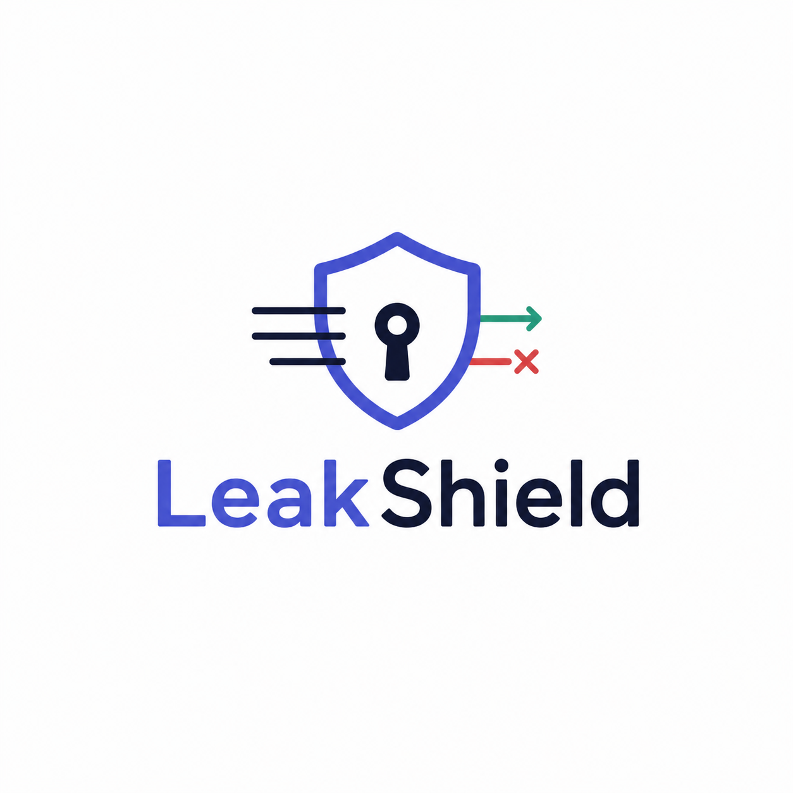
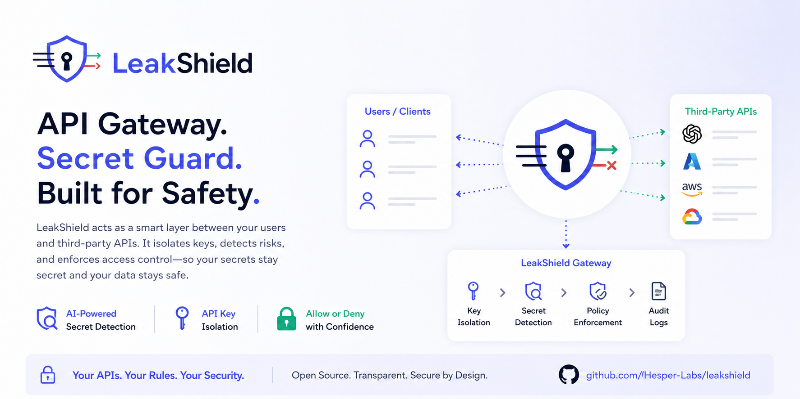

<div align="center">



# LeakShield

**API Gateway. Secret Guard. Built for Safety.**

[](LICENSE)
[](#)
[](#)
[](#)

</div>



LeakShield is an open-source **AI Gateway + DLP** that sits between your employees and the LLM
providers they use (OpenAI, Anthropic, Google, Azure). It isolates provider keys, inspects every
prompt with a **local LLM of your choice** for sensitive data leaks, and gives you full
per-employee audit and usage analytics.

## Why LeakShield

When employees use ChatGPT, Claude, or any LLM through your company's API key, they routinely paste
content that should never leave the building — customer records, identity numbers, contract text,
internal financials. That data ends up in provider logs and may end up in training pipelines. Most
existing tools fix only one half of this problem:

- DLP libraries (Llama Guard, NeMo, Presidio) classify content but don't manage keys, billing,
  or routing.
- AI gateways (LiteLLM, Portkey) manage keys and routing but ship no real DLP.
- Cloud DLP services (Lakera, Protect AI) work, but they're SaaS — your prompts leave your network.

LeakShield does both, locally. Your prompts never leave your infrastructure unless they pass DLP.

## Features

- **Multi-protocol native gateway** — OpenAI, Anthropic, Google Gemini, and Azure OpenAI exposed
  on their own native endpoints (`/openai/v1/*`, `/anthropic/v1/*`, etc.). Existing SDKs and CLIs
  (OpenAI Python, Anthropic Python, **Claude Code CLI**, Cursor, Aider, Continue.dev) work by just
  changing the `base_url`.
- **Per-employee virtual keys** — issue, revoke, rate-limit, and budget-cap keys per user.
  Master provider keys are stored encrypted under envelope encryption (KEK ⊃ DEK).
- **Pluggable local DLP** — pick your own model and your own strategy from the admin UI:
  - Specialized DLP classifiers (Llama Guard 3, ShieldGemma, etc.) — optional convenience
  - **Any general LLM as a judge** with a custom, admin-editable prompt (Llama 3.2, Qwen 2.5,
    Mistral, Phi — your call)
  - Hybrid: Microsoft Presidio (regex/NER, including Turkish-aware recognizers like TC kimlik,
    IBAN, GSM) escalating ambiguous content to your chosen LLM
- **Custom DLP policies** — edit the judge prompt in a Monaco-powered editor with a built-in
  test harness. An adversarial test suite gates deploys so a malicious admin can't ship an
  "always allow" prompt.
- **Multi-tenant** — many companies on one deploy, with PostgreSQL row-level security for hard
  tenant isolation.
- **Production-ready streaming** — SSE end-to-end with HTTP/2 multiplexing to providers.
  Optional output-side filtering for response-side leak prevention.
- **Full audit + analytics** — per-user requests, tokens, cost, blocked categories, latency
  percentiles. Live audit log via SSE. Tamper-evident hash chain on every record.
- **No model auto-download** — `docker compose up` works out of the box without pulling any LLM
  weights. The default inspector backend is a mock filter so you can wire up the gateway end-to-end
  before deciding which model you want.
- **On-premise first** — Docker Compose for dev/single-node, Helm chart for Kubernetes. KEK from
  Vault, AWS KMS, GCP KMS, or Azure Key Vault.

## Quick Start

```bash
git clone https://github.com/Hesper-Labs/leakshield
cd leakshield
docker compose up -d
# Panel at http://localhost:3000 → setup wizard walks you through:
#   1. Admin account
#   2. First provider key (OpenAI/Anthropic/Google/Azure)
#   3. First virtual key
#   4. DLP strategy + (optionally) which local LLM to use
#   5. Live test request
```

To enable a real local LLM (Ollama-backed) instead of the mock filter:

```bash
docker compose --profile local-llm up -d
# Then in the panel: Settings → DLP → Backend → Ollama
# Pick any model you've already pulled: `ollama pull qwen2.5:3b`, etc.
# LeakShield does NOT pull models for you — the choice and disk space are yours.
```

## Architecture

```
client SDK ─┬─ /openai/v1/*    ─┐
            ├─ /anthropic/v1/* ─┤
            ├─ /google/v1beta/*─┼─→ Gateway (Go) ─gRPC─→ Inspector (Python)
            └─ /azure/openai/* ─┘     │                        │
                                      ↓                        ↓
                                  PostgreSQL              Your local LLM
                                  Redis                   (Ollama / vLLM /
                                                           llama.cpp / any
                                                           OpenAI-compatible
                                                           server)
```

Detailed design: [docs/architecture.md](docs/architecture.md).

## Client Examples

### Claude Code CLI (Anthropic native)

```bash
export ANTHROPIC_BASE_URL=http://leakshield.example.com/anthropic
export ANTHROPIC_API_KEY=gw_live_xxxxxxxxxxxxxxxxxxxx
claude
```

### OpenAI Python SDK

```python
from openai import OpenAI
client = OpenAI(
    base_url="http://leakshield.example.com/openai/v1",
    api_key="gw_live_xxxxxxxxxxxxxxxxxxxx",
)
client.chat.completions.create(model="gpt-4o-mini", messages=[...])
```

### Anthropic Python SDK

```python
from anthropic import Anthropic
client = Anthropic(
    base_url="http://leakshield.example.com/anthropic",
    api_key="gw_live_xxxxxxxxxxxxxxxxxxxx",
)
client.messages.create(model="claude-sonnet-4-6", messages=[...])
```

More: [examples/](examples/).

## Repository Layout

| Directory | Contents |
|---|---|
| [`gateway/`](gateway/) | Go binary — proxy, admin API, worker |
| [`inspector/`](inspector/) | Python package — gRPC inspector + DLP strategies |
| [`panel/`](panel/) | Next.js admin panel |
| [`proto/`](proto/) | Inspector gRPC contract |
| [`deploy/`](deploy/) | Helm chart + production docker-compose |
| [`docs/`](docs/) | Architecture, security, deployment, provider guides |
| [`examples/`](examples/) | Client SDK / CLI examples |
| [`assets/`](assets/) | Logo + banner art |

## Status

**Pre-alpha** — under active development. Target for v1.0 is full-scope production-ready: four
provider adapters, three DLP strategies, streaming, admin panel, analytics, audit, KMS-backed
encryption, Helm chart.

Track progress: [milestones](https://github.com/Hesper-Labs/leakshield/milestones).

## License

[Apache 2.0](LICENSE).

## Contributing & Security

- [CONTRIBUTING.md](CONTRIBUTING.md) — development setup, testing, PR conventions.
- [SECURITY.md](SECURITY.md) — how to report a vulnerability.
