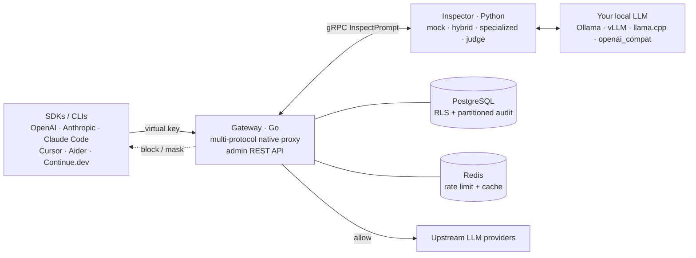

# LeakShield Wiki

Welcome to the LeakShield wiki. This is the long-form documentation home for the project. The
top-level [README](https://github.com/Hesper-Labs/leakshield) is the elevator pitch; this is the
in-depth manual.

## Where to start

| If you are… | Read |
|---|---|
| trying it out for the first time | [Quickstart](Quickstart) |
| operating it for your team | [Self-Hosting Guide](Self-Hosting-Guide) → [Deployment: Docker Compose](Deployment-Docker-Compose) |
| wiring it into Kubernetes | [Deployment: Kubernetes](Deployment-Kubernetes) |
| understanding the design | [Architecture](Architecture) |
| writing a custom DLP policy | [DLP Categories](DLP-Categories) → [Policy Editor](Policy-Editor) |
| integrating an SDK or CLI | [Client Examples](Client-Examples) |
| building against the admin API | [API Reference](API-Reference) |
| contributing code | [Contributing](Contributing) |
| evaluating it against alternatives | [Comparison](Comparison) |
| asking common questions | [FAQ](FAQ) |

## What is LeakShield, in 60 seconds

LeakShield sits between your employees (or any LLM-using application inside your network) and the
upstream LLM providers — OpenAI, Anthropic, Google, Azure. It does three things at once:

1. **Isolates provider credentials.** Your master `sk-…` keys stay encrypted at rest under a
   per-tenant Data Encryption Key wrapped by a Key Encryption Key sourced from a KMS or a 0600
   local file. End users never see them. Every employee gets a virtual key (`gw_live_…`) that the
   gateway maps to a master key on the fly.
2. **Inspects every prompt.** A local LLM of your choice — or a regex / NER fast path, or a
   purpose-built DLP classifier — looks at every request before it reaches a provider. Built-in
   recognizers cover universal PII and secrets; per-tenant categories let an admin describe what
   *that specific company* considers sensitive (project codenames, customer lists, M&A
   discussions, contracts, source code with embedded keys).
3. **Records what happened.** A monthly-partitioned, hash-chained audit log captures every
   request: who, when, what model, how many tokens, what the verdict was, and (optionally) the
   redacted prompt. The panel surfaces this as a live SSE stream and as cost / token / block-rate
   analytics.

All three components — gateway, DLP inspector, admin panel — are open source, Apache 2.0, and run
inside your network. There is no managed SaaS, no telemetry, no phone-home.

## High-level architecture

See the full design in [Architecture](Architecture).

## Project status

LeakShield is **pre-alpha** under active development. The `main` branch is functional end-to-end
(admin bootstrap → provider connect → virtual key issuance → live proxy) but several
production-critical features are still wired as stubs. The
[CHANGELOG](https://github.com/Hesper-Labs/leakshield/blob/main/CHANGELOG.md) and the
[`Roadmap`](Roadmap) wiki page list what's in and what's pending.

## Reaching the project

- Issues: [github.com/Hesper-Labs/leakshield/issues](https://github.com/Hesper-Labs/leakshield/issues)
- Discussions: [github.com/Hesper-Labs/leakshield/discussions](https://github.com/Hesper-Labs/leakshield/discussions)
- Security disclosures: see [SECURITY.md](https://github.com/Hesper-Labs/leakshield/blob/main/SECURITY.md)

License: [Apache 2.0](https://github.com/Hesper-Labs/leakshield/blob/main/LICENSE).
